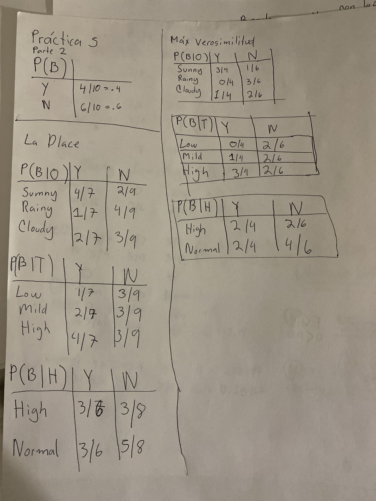
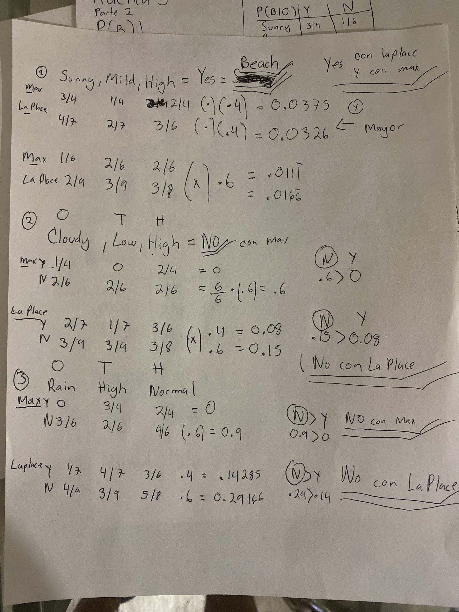
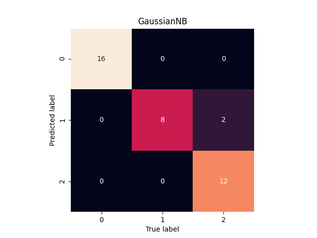
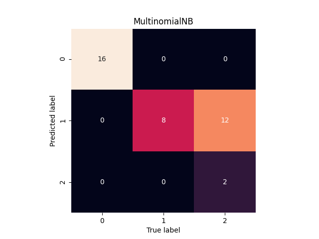

### Parte 2: Ejercicio manual de Naïve Bayes

¿Los métodos de cálculo de probabilidad clasifican de forma diferente a lasinstancias de prueba?

R: No, en todos los casos LaPlace y Maxima Verosimilitud clasifican de la misma manera.

### Parte 3: Uso de Naïve Bayes con Scikit-Learn

Ejecutar `parte3.py`

Resultado

        GaussianNB
        0.9473684210526315
        [[16  0  0]
         [ 0  8  0]
         [ 0  2 12]]
                      precision    recall  f1-score   support
                   0       1.00      1.00      1.00        16
                   1       0.80      1.00      0.89         8
                   2       1.00      0.86      0.92        14
            accuracy                           0.95        38
           macro avg       0.93      0.95      0.94        38
        weighted avg       0.96      0.95      0.95        38

        MultinomialNB
        0.6842105263157895
        [[16  0  0]
         [ 0  8  0]
         [ 0 12  2]]
                      precision    recall  f1-score   support
                   0       1.00      1.00      1.00        16
                   1       0.40      1.00      0.57         8
                   2       1.00      0.14      0.25        14
            accuracy                           0.68        38
           macro avg       0.80      0.71      0.61        38
        weighted avg       0.87      0.68      0.63        38

#### Reflexión

Pudimos observar que utilizando el clasificador GaussianNB tuvimos una precision de casi el 95%

Mientras que con el Multinomial NB la precision disminuyó a un 68%

### Reto por 100 puntos extra (Spam Clasifier)

Ejecutar `spam.py`

Resultado

    0.9506726457399103
    [[957   0]
     [ 55 103]]

#### Descripción

En esta practica implementamos un clasificador de spam usando el 'SMS Spam Collection Dataset' de la Universidad de California, Irvine.

Tenemos dos columnas en una va si el mensaje es spam o no y en otra va el mensaje en sí.

#### Reflexión

Para lograr clasificar correctamente los mensajes es necesario hacer un preprocesamiento
adecuado de los mensajes. Como por ejemplo: eliminar caracteres especiales, 'stop words', transformar todo a minusculas, algoritmo Stemmer.
Esto es necesario debido a que es información que no provee ningún valor y seguramente introduciría ruido a nuestro modelo.

Lo que me llamó mucho la atención fue que al NO aplicar lo anteriormente descrito (normalización), para mi sorpresa, la precisión aumentó en un 2%

    0.9757847533632287

Esto iba en contra de toda lógica, entonces observando la matriz de confusión:

    [[944  13]
     [ 14 144]]

Me di cuenta que los falsos positivos aumentaron de 0 a 13 es decir, se anteriormente
se podía predecir con 100% de exactitud los mensajes que sí son legitimos.

Entonces me di cuenta de que la precisión en % no es la única métrica que debemos tomar en cuenta, por lo que modifiqué el programa para que mostrara el clasification report completo.

Sin normalizar:
    
    {'ham': 0, 'spam': 1}

    0.9757847533632287
    [[944  13]
     [ 14 144]]
                  precision    recall  f1-score   support
               0       0.99      0.99      0.99       957
               1       0.92      0.91      0.91       158
        accuracy                           0.98      1115
       macro avg       0.95      0.95      0.95      1115
    weighted avg       0.98      0.98      0.98      1115

Normalizando:

    0.9506726457399103
    [[957   0]
     [ 55 103]]
                  precision    recall  f1-score   support
               0       0.95      1.00      0.97       957
               1       1.00      0.65      0.79       158
        accuracy                           0.95      1115
       macro avg       0.97      0.83      0.88      1115
    weighted avg       0.95      0.95      0.95      1115

Ya con el reporte completo es más fácil observar que para la categoria de spam se encontraron 0 falsos positivos 
lo que nos da un 100% de precisión para spam

Por el contrario para 'ham' nos da una precisión de 95% con 55 falsos negativos.

#### Aprendizaje y conclusiones

Es importante que nos fijemos en distintas métricas para determinar si nuestro modelo es adecuado.

El éxito de nuestro modelo depende en gran medida del preprocesamiento de los datos.

El modelo de Naive Bayes es bueno para encontrar una probabilidad basado en palabras clave, sin embargo, en mi opinión sería ideal combinarlo con algun otro 
modelo que tomara en cuenta el orden de las palabras para que este fuera mas adecuado así como algunos otros metodos
heuristicos que nos permitan determinar de manera muy acertada la clasificación de una instancia.

#### Referencias

    https://www.kaggle.com/redaabdou/sms-spam-solution-data-cleaning-ml
