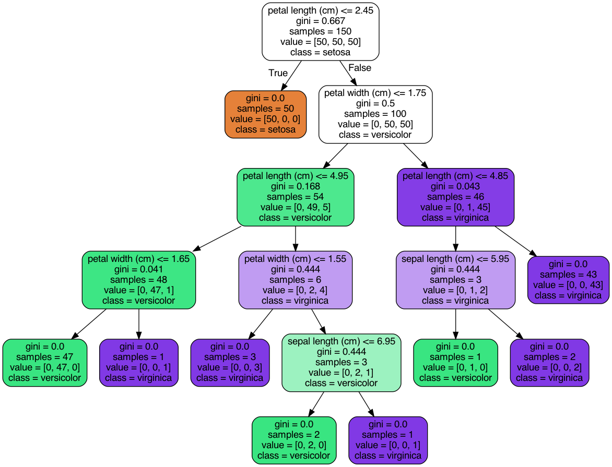

## Practice #2 Report

In this second practice, we used logistic regression as well as decision trees.

We used Sci-Learn's Logistic Regression implementation, DecisionTreeClassifier and my own Logistic Regression implementation.

## Usage

    Practice2.py

This will generate iris_tree.png

    Practice2_1.py

This will load the breast_cancer, iris and wine dataset, test and train them against Logistic Regression and Decision Tree algorithms

## Results

SciLearn's implementations yielded very similar results with >95% accuracy rate.

My implementation in only one case yielded >95% accuracy rate. I think this is due to SciLearn's learning rate and other parameters being optimized.

Decision tree:

## Reflections

- Parameter optimization is very important.
  

- I think that because these are very simple/obvious datasets the learning algorithm doesn't make a difference (both having very similar accuracy rate). 
However for other datasets, or other cases, one must choose the best algorithm for the job.
  

- I think the decision tree algorithm is quite nice because you can have a visual representation of how an instance is going to be classified. However, as far as I know, it has its downsides compared to other algorithms. And this might only be useful when the tree is small. 

- Didn't get 'plot_decision_boundary' to work.

#References
    https://scikit-learn.org/stable/modules/generated/sklearn.datasets.load_breast_cancer.html
    https://medium.com/@kgpvijaybg/logistic-regression-on-iris-dataset-48b2ecdfb6d3
    https://jamesrledoux.com/code/train_test_split
    - J, Guillermo Falcon. “Práctica 2 Aprendizaje automático” 2021. PDF file.
    https://stackoverflow.com/questions/54884252/check-the-accuracy-of-decision-tree-classifier-with-python
    https://scikit-learn.org/stable/modules/tree.html
    https://scikit-learn.org/stable/modules/generated/sklearn.tree.DecisionTreeClassifier.html